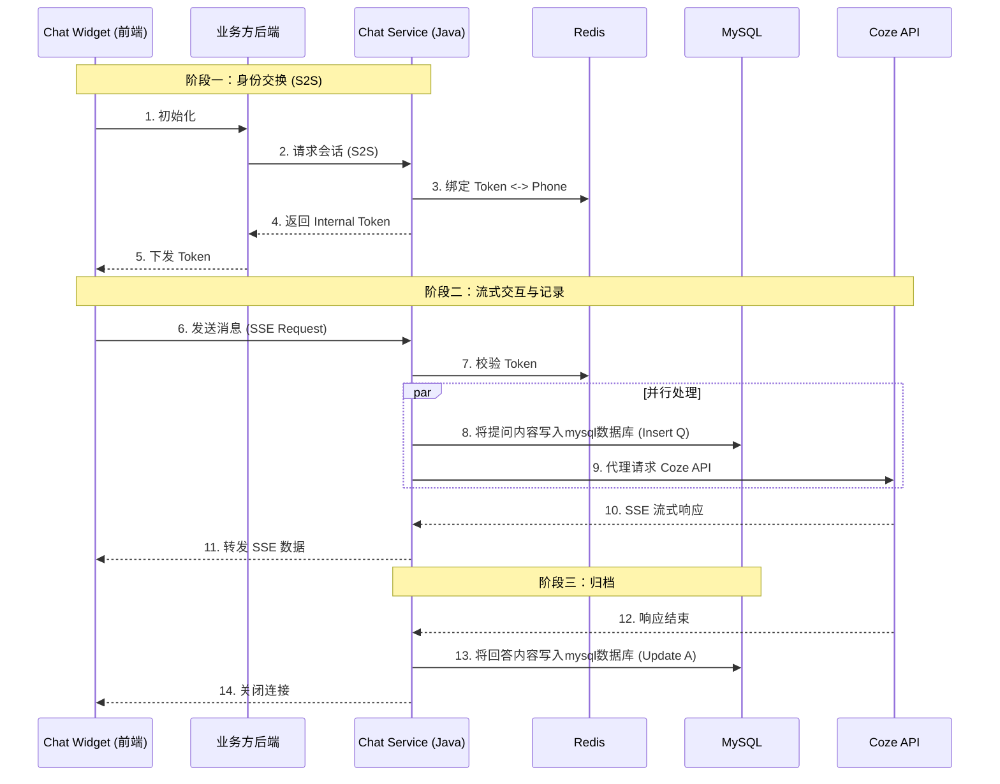

# Volcano Chat System

Volcano Chat 是一个生产级的 AI 对话系统，采用 **Java (Spring Boot)** 后端全权代理模式，前端基于 **Vue 3 / Nuxt 3** 开发。系统集成了 Coze API，支持流式对话 (SSE)、语音交互 (ASR/TTS) 及全链路日志记录。

## 1. 系统架构与时序

系统采用前后端分离架构，后端负责鉴权、API 代理及数据持久化。

### 交互时序图



---

## 2. 快速启动 (Quick Start)

### 环境要求
*   **JDK**: 17+
*   **Node.js**: 18+
*   **MySQL**: 8.0+ (可选，未配置时后端会自动禁用数据库功能)
*   **Redis**: 必须 (默认 localhost:6379)

### 步骤一：启动后端 (Chat Service)

后端服务运行在 `8081` 端口。

```bash
cd chat-service

# 1. 配置 (可选)
# 编辑 src/main/resources/application.properties 配置 MySQL/Redis
# 默认已禁用 MySQL，仅依赖 Redis 即可启动

# 2. 运行
./mvnw spring-boot:run
# 或者
mvn spring-boot:run
```

### 步骤二：启动前端 (Chat Widget)

前端开发服务器运行在 `3000` 端口。

```bash
cd chat-widget

# 1. 安装依赖
npm install

# 2. 启动开发模式
npm run dev
```

### 步骤三：验证

1.  打开浏览器访问前端：`http://localhost:3000`
2.  默认会进入 Demo 页面，尝试发送消息。
3.  查看后端控制台日志，确认 SSE 连接及 Coze 代理状态。

## 3. 目录结构

*   `chat-service/`: Java Spring Boot 后端源码
*   `chat-widget/`: Nuxt 3 前端源码
*   `docs/`: 详细架构文档与数据库 SQL
