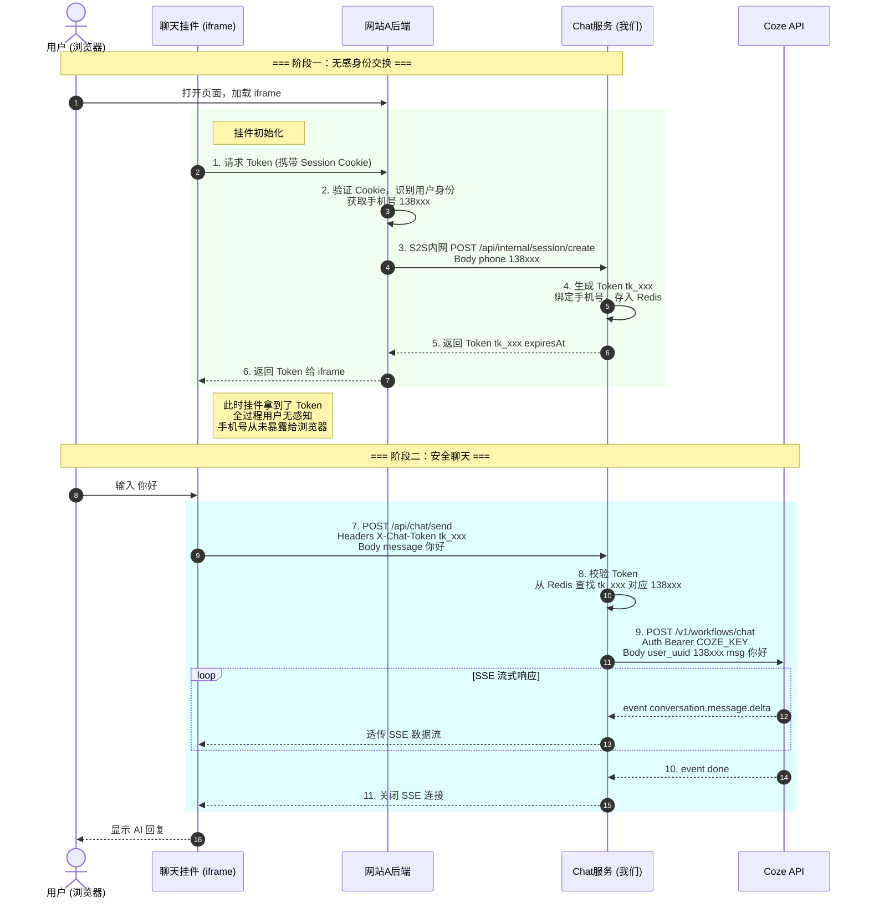

# 项目时序逻辑与架构文档

## 1. 系统架构概览

本系统采用 **代理模式** 架构，保护敏感信息（手机号、Coze API Key）不暴露给浏览器。

| 组件 | 技术栈 | 职责 |
|------|--------|------|
| Chat Widget (iframe) | Vue 3 / Nuxt 3 | 聊天界面、SSE 渲染 |
| 网站A后端 | 任意（由客户实现） | 验证用户身份、S2S换Token |
| Chat Service 后端 | Java Spring Boot | 签发Token、代理Coze |
| Coze API | 外部服务 | LLM 推理 |

---

## 2. 完整时序图

---

## 3. 关键安全点

1. **手机号从不暴露给浏览器**：只在 网站A后端 -> Chat后端 的 S2S 请求中传输
2. **Token 不透明**：即使被窃取，也无法反推手机号
3. **Coze Key 服务端保管**：前端永远不接触

---

## 4. 当前代码状态

| 接口 | 状态 | 说明 |
|------|------|------|
| `/api/mock/website-a/init` | Mock | 模拟网站A后端，开发测试用 |
| `/api/internal/session/create` | 生产 | 真正的 S2S 接口，生产环境网站A调用 |

生产部署时，iframe 应调用**网站A的真实后端**，由网站A后端调用我们的 `/api/internal/session/create`。
