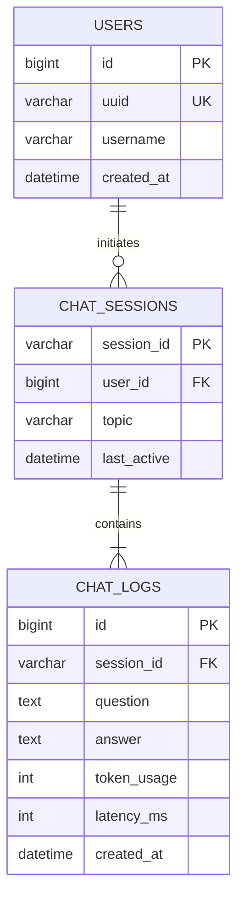

# Volcano Chat 智能对话与审计系统 - 软件设计规格说明书

> **文档状态**: Alpha Draft
> **版 本 号**: V1.0.0
> **最后更新**: 2025-12-16

---

## 1. 软件需求规格说明书 (Software Requirements Specification)

### 1.1 项目愿景 (Vision)
本项目旨在构建一套企业级智能对话系统 **Volcano Chat**。该系统需集成先进的 LLM 能力（如 Coze 平台），为终端用户提供低延迟、多模态（文本/语音）的交互体验，同时满足企业对于合规性、数据沉淀及服务质量的审计需求。系统应具备高度的可扩展性，能够以组件化形式嵌入第三方业务系统。

### 1.2 用户画像 (User Personas)
*   **终端用户 (End User)**: 企业内部员工或 C 端客户，需要通过简单的聊天界面获取 AI 辅助，期望响应速度快、体验自然。
*   **系统管理员 (Admin)**: 负责监控对话质量、查看历史日志、配置 AI 机器人参数及管理用户权限。

### 1.3 功能需求 (Functional Requirements)

#### 1.3.1 核心对话模块 (Core Chat)
*   **F-CHAT-01 [流式响应]**: 系统**必须**支持 SSE (Server-Sent Events) 协议，实现 AI 回复的打字机效果，首字延迟 < 1s。
*   **F-CHAT-02 [多模态输出]**: 系统**应**支持 TTS (Text-to-Speech)，将 AI 的文本回复实时转换为语音播放，并提供流式音频缓冲以减少卡顿。
*   **F-CHAT-03 [会话管理]**: 
    *   用户可创建新会话、切换历史会话。
    *   系统需持久化保存会话上下文 (Conversation ID)，确保页面刷新后对话不丢失。
*   **F-CHAT-04 [异常处理]**: 当网络中断或 AI 服务异常时，需在 UI 层面提供友好的错误提示及重试机制。

#### 1.3.2 审计与日志模块 (Audit & Logging)
*   **F-LOG-01 [全量归档]**: 所有的“用户提问-AI回答”对 (QA Pair) **必须**在对话结束时自动异步上报至后端。
*   **F-LOG-02 [元数据记录]**: 日志需包含 `User UUID`（用户标识）、`Session ID`、`Timestamp`、`Token Usage`（预留字段）等元数据。
*   **F-LOG-03 [灾备存储]**: 若后端服务不可用，前端应具备本地缓存（LocalStorage）机制，待网络恢复后补传（P2 优先级）。

#### 1.3.3 管理后台模块 (Admin Dashboard) \[规划中]
*   **F-ADMIN-01 [日志查询]**: 管理员可通过时间范围、用户 ID 检索历史对话记录。
*   **F-ADMIN-02 [配置热更]**: 支持在不重启服务的情况下动态更新 Coze Bot ID 和 API Key。

### 1.4 非功能需求 (Non-functional Requirements)
*   **NFR-01 [性能]**: 支持 1000+并发连接（基于 NIO/Netty 模型）。
*   **NFR-02 [兼容性]**: 前端组件需适配 Chrome 80+, Safari 14+, Edge 等主流浏览器，并兼容移动端 Webview。
*   **NFR-03 [安全性]**: 
    *   后端 API 需实施 `Authorization` 鉴权。
    *   敏感配置（如 API Key）严禁硬编码在前端代码中（*注：Demo 阶段暂由前端持有临时 Token，生产环境需经由 BFF 层转发*）。

---

## 2. 概要设计说明书 (High-Level Design)

### 2.1 系统架构 (System Architecture)

系统采用前后端分离的微服务架构。前端作为"哑终端"负责渲染与流处理，后端作为"控制平面"负责持久化与鉴权。

```mermaid
graph TB
    subgraph Client [客户端层]
        Web[Web Browser / H5]
        App[Mobile App WebView]
    end

    subgraph FE [前端应用层 (Nuxt 3)]
        Widget[Chat Widget SDK]
        State[Conversation State Manager]
        Proxy[API Forwarder (Dev Only)]
    end

    subgraph BE [后端服务层 (Spring Boot)]
        Gateway[API Gateway / Nginx]
        LogSvc[Log Service]
        AuthSvc[Auth Service (Planned)]
    end

    subgraph Data [数据层]
        MySQL[(Primary DB)]
        Redis[(Session Cache / Planned)]
    end

    subgraph AI [AI 能力层]
        Coze[Coze Inference Engine]
        TTS[Coze TTS Service]
    end

    Web --> Widget
    Widget -->|SSE/WebSocket| Coze
    Widget -->|REST POST| LogSvc
    LogSvc --> MySQL
```

### 2.2 技术栈选型 (Technology Stack)

| 领域 | 选型 | 理由 |
| :--- | :--- | :--- |
| **Frontend Framework** | **Nuxt 3 (Vue 3 + TS)** | 支持 SSR/SSG，利于 SEO（如有官网需求）；组件化能力强，易于封装 SDK。 |
| **UI Library** | **Arco Design Vue** | 字节系企业级 UI 库，设计风格现代，与 Coze 审美契合。 |
| **Build Tool** | **Vite** | 极速构建，开发体验优于 Webpack。 |
| **Backend Language** | **Java 17 (LTS)** | 强类型，生态成熟，适合企业级后端开发。 |
| **Backend Framework** | **Spring Boot 3.2** | 约定优于配置，快速启动，集成 MyBatis 方便。 |
| **Persistence** | **MySQL 8.0** | 关系型数据存储事实标准，支持 JSON 字段扩展。 |
| **ORM** | **MyBatis Plus** | 简化 CRUD 操作，提供强大的代码生成器。 |

---

## 3. 详细设计说明书 (Detailed Design)

### 3.1 前端：状态机与交互设计
**核心组件**: `useCozeChat` Hook
设计模式：`Composition API` + `Event Driven`

#### 3.1.1 状态定义
```typescript
interface ChatState {
  messages: Message[];       // 消息队列
  conversationId: string;    // 会话标识
  status: 'idle' | 'thinking' | 'streaming' | 'error'; // 有限状态机
}
```

#### 3.1.2 消息发送时序
1.  **Trigger**: 用户点击发送。
2.  **Optimistic UI**: 立即将用户消息推入 `messages` 数组渲染。
3.  **Placeholder**: 推入一个空的 AI 消息对象 (status=loading)。
4.  **Request**: 调用 `fetch` 接口。
5.  **Stream Loop**:
    *   读取 `ReadableStream`。
    *   解析 `event: conversation.message.delta`。
    *   更新最后一条 AI 消息的 `content`。
6.  **Complete**: 收到 `event: done` 或流结束。
7.  **Hook**: 触发 `logChatToBackend()` 异步上报。

### 3.2 后端：日志服务设计
**核心类**: `LogController`

该服务设计为高吞吐、低延迟的写入服务。

*   **接收策略**: 采用 `@Async` 或消息队列（如 RocketMQ/Kafka，规划中）进行异步入库，避免阻塞 HTTP 响应线程。
*   **幂等性**: 客户端需上报 `UUID`（Request ID），后端根据 `UUID` + `Timestamp` 进行去重（防止网络抖动导致的重复上报）。

---

## 4. 数据库设计说明书 (Database Design)

### 4.1 ER 关系图



### 4.2 物理表结构 (Schema)

*> 注意：MVP 阶段 (Demo) 先行实现 `chat_logs` 单表，后续迭代 `users` 和 `sessions` 表。*

**表名**: `chat_logs` (日志流水表)

| 字段名 (Column) | 类型 (Type) | 约束 (Constraint) | 默认值 | 说明 (Description) |
| :--- | :--- | :--- | :--- | :--- |
| `id` | BIGINT | PRIMARY KEY, AUTO_INCREMENT | - | 物理主键 |
| `user_uuid` | VARCHAR(64) | NOT NULL, INDEX | - | 用户匿名标识或 ID |
| `session_id` | VARCHAR(64) | INDEX | NULL | (P2) 会话 ID，用于聚合上下文 |
| `question` | TEXT | - | - | 用户输入 Payload |
| `answer` | MEDIUMTEXT | - | - | AI 响应 Payload (支持 Markdown) |
| `status` | TINYINT | - | 1 | 1=成功, 0=失败 |
| `created_at` | DATETIME | - | CURRENT_TIMESTAMP | 记录时间 |

---

## 5. 接口设计说明书 (API Specification)

### 5.1 【内部】日志上报 API

*   **Endpoint**: `/api/logs`
*   **Method**: `POST`
*   **Access**: Internal & Protected

#### Request Header
*   `Connect-Type`: `application/json`
*   `X-App-Id`: `<AppId>` (用于区分不同接入端)

#### Request Body
```json5
{
  "userUuid": "u-1f8a9c0d", // 必填，用户唯一标识
  "sessionId": "s-8829102", // 选填，会话 ID
  "question": "如何优化 Java GC?", // 必填
  "answer": "优化 Java GC 可以从以下几个方面入手...", // 必填
  "meta": {                 // 选填，扩展元数据
    "model": "gpt-4",
    "latency": 1200
  }
}
```

#### Response
```json
{
  "code": 200,
  "msg": "SUCCESS",
  "data": {
    "traceId": "log-7782190" // 用于追踪的凭证
  }
}
```

### 5.2 【外部】Coze Open API (Chat)

*   **Base URL**: `https://api.coze.cn/v1`
*   **Endpoint**: `/workflows/chat`
*   **Method**: `POST`
*   **Protocol**: HTTPS + SSE (Server-Sent Events)

*> 前端直接调用此接口，或通过 Nginx 反向代理转发以解决 CORS 问题。*

---

## 6. 部署与运维规划 (Deployment & DevOps)

*   **容器化**: 所有服务需通过 `Dockerfile` 提供镜像构建脚本。
*   **编排**: 提供 `docker-compose.yml` 用于本地一键拉起由于（MySQL + Backend）。
*   **CI/CD**: 代码提交主干后自动触发 Jenkins/GitHub Actions 构建流程，自动部署至开发环境。
