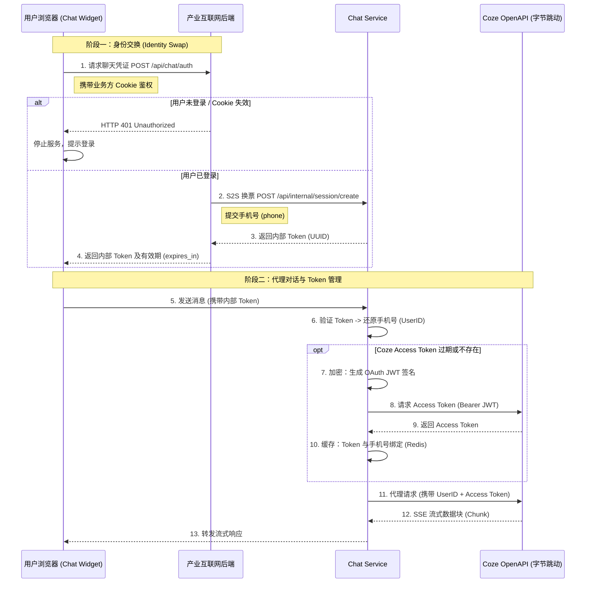

# 产业互联网后端接口约定文档

> **对接方**: 产业互联网后端
> **服务方**: Chat Service
> **文档目标**: 定义前端聊天组件与产业互联网后端之间的通信契约，确保 Token 的安全分发与生命周期管理。

---

## 1. 核心交互流程

系统采用 **Identity Swap (身份交换)** 模式。前端组件不直接持有用户身份，而是通过产业互联网后端签发的临时 Token 与 Chat Service 通信。

### 交互时序



---

## 2. 需提供的接口 (Required Interface)

产业互联网后端仅需提供这 **唯一** 一个接口，即可同时满足**初始化**和**无感续期**的需求。

### 接口：获取/刷新聊天凭证
*   **建议路径**: `/api/chat/auth` (前端可配置)
*   **调用频率**: 低 (仅在页面加载或每 2 小时调用一次)

#### 请求定义
*   **Method**: `POST` (推荐) 或 `GET`
*   **Headers**: 
    *   `Cookie`: 依赖浏览器自动携带，用于识别当前登录用户。

#### 后端逻辑要求
1.  **鉴权**: 必须校验当前请求的 Cookie/Session。若无效，直接返回 401。
2.  **服务调用**: 同步调用 Chat Service 的内部接口 (见第 3 节)，获取 `token`。
3.  **返回**: 将 `token` 封装后返回给前端。

#### 响应体 (Response Schema)

```json
{
  "code": 200,          // 业务状态码 (200 表示成功)
  "msg": "success",
  "data": {
    "token": "c71e8d90-xxxx-xxxx-xxxx-xxxxxxxx",  // [必须] Chat Service 访问令牌
    "expires_in": 7200,                           // [必须] Token 有效期(秒)，前端据此设定自动刷新定时器
    "user_info": {                                // [可选] 用于前端展示的用户信息
      "nickname": "张三",
      "avatar_url": "https://example.com/avatar.png"
    }
  }
}
```

---

## 3. 产业互联网后端需调用的 Chat Service 接口 (S2S)

本节定义了产业互联网后端在实现上述第 2 节接口时，其后端代码需要发起的下游请求（Server-to-Server）。

*   **服务地址**: `http://<chat-service-host>:8081` (内网地址)
*   **接口路径**: `/api/internal/session/create`
*   **Method**: `POST`
*   **Content-Type**: `application/json`

### 请求体
```json
{
  "phone": "13800138000",   // [必须] 用户的唯一标识 (手机号或 UserID)
                            // 将作为 Coze 侧的 session_name 实现数据隔离
  "source": "industrial_internet" // [可选] 来源标识
}
```

### 响应体
```json
{
  "token": "c71e8d90-xxxx-xxxx-xxxx-xxxxxxxx"
}
```

---

## 4. 前端行为说明 (Client Behavior)

Chat Widget 会严格遵循以下策略，确保对产业互联网后端的调用是克制且安全的：

1.  **初始化**: 组件挂载 (`onMounted`) 时立即调用 `/api/chat/auth`。
2.  **静默刷新**: 根据返回的 `expires_in`，在过期前 5 分钟自动再次调用该接口刷新 Token。
3.  **被动重试**: 
    *   若 Chat Service 请求返回 `401 Unauthorized` (如 Token 意外失效)，组件会立即暂停队列。
    *   尝试调用 `/api/chat/auth` 一次。
    *   若成功，使用新 Token 重发失败的消息；若失败 (如用户真的退出了)，则锁定聊天框并报错。

---

## 5. 部署与环境切换

为了平衡开发效率与生产安全，前端组件支持通过环境变量进行无感切换。

### 环境变量定义
| 变量名 | 说明 | 示例值 |
| :--- | :--- | :--- |
| `NUXT_PUBLIC_CHAT_AUTH_URL` | 指向产业互联网后端的鉴权接口 | `https://api.example.com/api/chat/auth` |

### 切换逻辑
1.  **开发阶段**: 无需配置该变量。前端默认指向 Chat Service 提供的内置 Mock 接口，方便进行功能调试。
2.  **生产阶段**: 在部署前端容器或服务时，必须注入该环境变量，指向真实的业务方后端地址。此时，内置 Mock 接口将被自动屏蔽，系统进入正式的安全对接模式。
