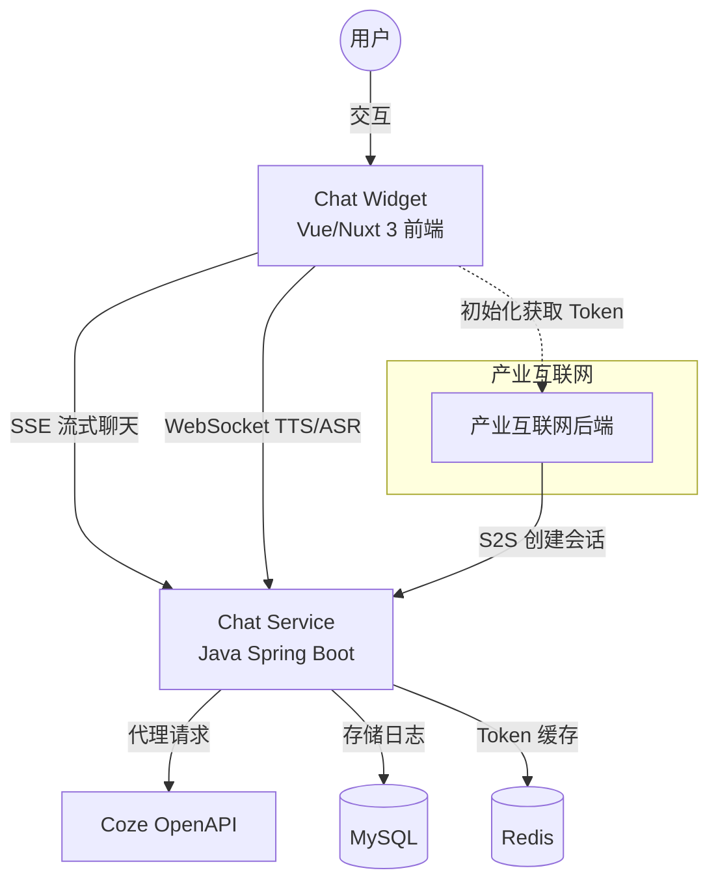
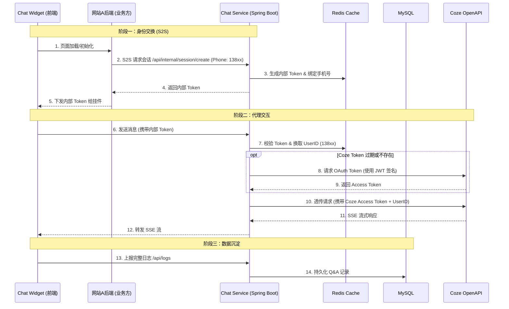

# Volcano Chat 生产级系统设计规约 (2025 Revised)

基于最新的代码实现分析，本规约反映了系统当前的实际架构：**Java 后端全权代理模式**。

## 1. 核心架构：全栈 Java 代理

系统已摒弃独立的 Node.js Token 服务，将所有安全、鉴权与代理逻辑收敛至 Java Spring Boot 后端。同时，保留了**身份交换 (Identity Swap)** 模式，确保业务方（网站A）对用户身份的掌控。

### 整体架构图

### 交互时序图

## 2. 关键技术变更

### 2.1 鉴权服务内聚 (Refactored)
*   **旧方案**: 依赖 `coze-token-service` (Node.js) 生成 JWT。
*   **新方案**: `Chat Service` 内部集成 `CozeAccessTokenProvider`。
    *   直接使用 `coze-api` Java SDK。
    *   实现了 OAuth Token 的自动获取与本地缓存。
    *   增加了 PAT (Personal Access Token) 作为降级容灾方案。

### 2.2 存储方案
*   **Redis**: 存储 `Internal Token` <-> `User Phone` 的映射，以及 `Coze Access Token` 缓存。
*   **MySQL**: 存储结构化的聊天日志（问答对）。

---

## 3. 待办事项

### 已完成
- [x] Token 服务内化：Java 后端原生支持 Coze OAuth JWT
- [x] 代理接口：`/api/chat/send` 接管 Coze 通信
- [x] Widget 连接 Java 后端 (Port 8081)

### 待处理
- [ ] S2S 鉴权增强：为 `/internal/session/create` 加 IP 白名单或签名校验
- [ ] SSE 重连机制：网络波动下的稳定性
- [ ] 限流策略：按 UserID 或 IP 限速
- [ ] 日志审计：完善 MySQL 日志结构